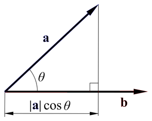
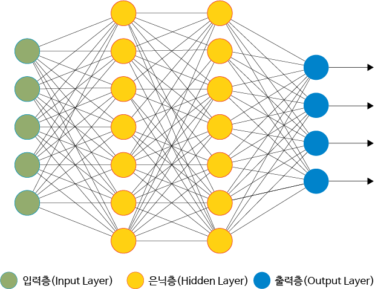
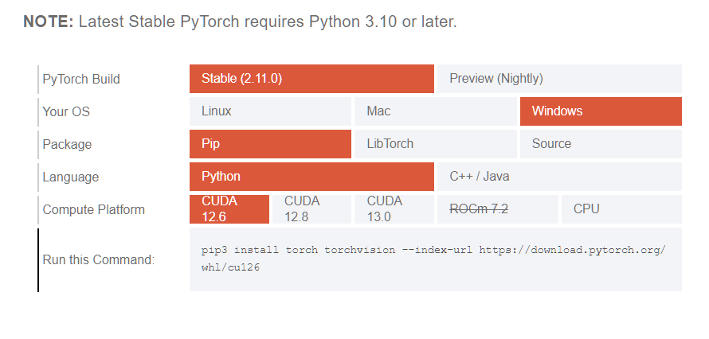
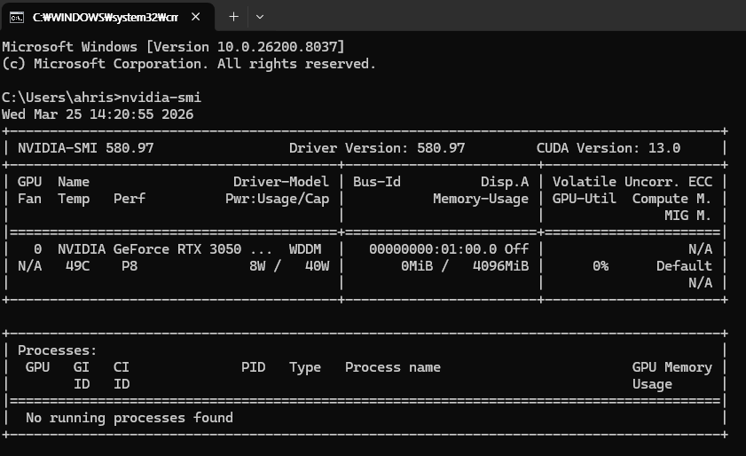
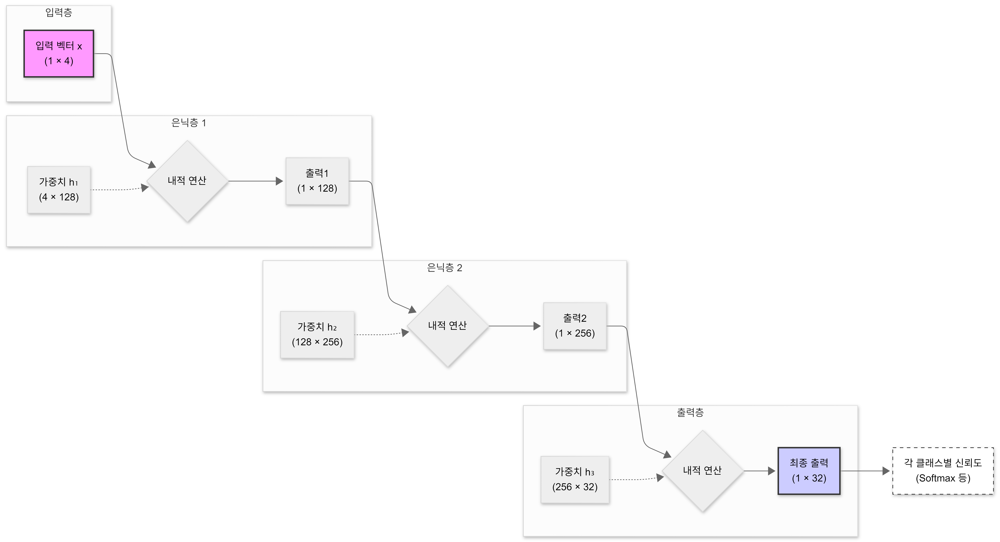

# 1. 내적이란?



내적(dot product)은 두 벡터가 **얼마나 같은 방향을 가리키는지** 측정하는 연산입니다.

예를 들어, X축 방향의 단위벡터 $\hat{i} = (1, 0)$과 임의의 벡터 $A = (5, 4)$가 있을 때, 내적은 다음과 같습니다:

$$
A \cdot \hat{i} = 5 \times 1 + 4 \times 0 = 5
$$

이 결과는 벡터 $A$가 **$\hat{i}$ 방향으로 얼마만큼의 성분을 가지는지**를 나타냅니다.

$B = (1, 2)$와 $A = (5, 4)$를 내적하면 $1 \times 5 + 2 \times 4 = 13$입니다. $A$는 $B$ 방향의 성분을 13만큼 가지고 있다고 해석할 수 있습니다.

일반적으로 내적은 다음과 같이 정의됩니다:

$$
A \cdot B = |A||B|\cos \theta
$$

만약 $B$가 단위벡터($|B| = 1$)라면, 내적 값은 곧 $A$를 $B$ 방향으로 정사영한 크기가 됩니다.

# 2. 인공신경망이란?

인공신경망(Artificial Neural Network)은 동물의 뇌를 구성하는 뉴런과 시냅스의 동작 방식을 모방하여 만든 계산 모델입니다.



## 2-1. 음식 분류로 이해하는 신경망

음식을 예로 들어봅시다. 탕수육은 짠맛, 신맛, 매운맛, 단맛이라는 4개의 특성으로 표현할 수 있습니다. 마찬가지로 다른 음식들도 각각의 특성 벡터를 가집니다:

- 동파육: 특성 벡터
- 짜장면: 특성 벡터
- 깐풍기: 특성 벡터

이제 탕수육과 각 음식의 **유사도**를 **내적**으로 측정해봅시다:

- 탕수육 vs 동파육: 0.55
- 탕수육 vs 짜장면: 0.4
- 탕수육 vs 깐풍기: 0.7

내적 값이 클수록 두 음식이 비슷하다는 뜻입니다. 이처럼 내적을 통해 유사도를 판단하는 것이 신경망의 **기초 원리**입니다.

## 2-2. 실제 신경망의 구조

위에서는 4개의 음식만 비교했지만, 실제 신경망은 훨씬 복잡합니다:

1. **입력층(Input Layer)**: 원본 데이터 (예: 4개 특성)
2. **은닉층(Hidden Layer)**: 데이터를 다양한 관점에서 재표현
   - 첫 번째 은닉층: 1×4 입력을 4×5 가중치 행렬과 곱하여 → 1×5 출력
   - 두 번째 은닉층: 1×5 입력을 5×3 가중치 행렬과 곱하여 → 1×3 출력
3. **출력층(Output Layer)**: 최종 판단 (예: 음식 분류 결과)

각 계층 사이에서 **내적(행렬곱)**이 일어나고, 이를 여러 층에 걸쳐 반복하면서 복잡한 패턴을 학습합니다.

# 3. NumPy로 구현하기

```python
import numpy as np

# 입력 데이터 (1×4) - 짠맛, 신맛, 매운맛, 단맛의 정도
# 우리가 측정한 어떤 음식에 대해 알려준다
input_data = np.array([1, 2, 3, 2.5])

# 첫 번째 가중치 행렬 (4×5)
weights_1 = np.array([
    [0.1, 0.2, 0.3, 0.4, 0.5],
    [0.2, 0.3, 0.4, 0.5, 0.6],
    [0.3, 0.4, 0.5, 0.6, 0.7],
    [0.4, 0.5, 0.6, 0.7, 0.8]
])

# 첫 번째 은닉층: 입력과 가중치의 내적
hidden_1 = np.dot(input_data, weights_1)  # 결과: 1×5

# 두 번째 가중치 행렬 (5×3) - 하나하나 만들기 어려우니, 이번에는 랜덤한 생각을 넣어보자
weights_2 = np.random.randn(5, 3)
hidden_2 = np.dot(hidden_1, weights_2)  # 결과: 1×3

# 최종 출력 (1×3)
print(hidden_2)
```

출력된 세 개의 값은 각 클래스(예: 똠양꿍, 짜장면, 깐풍기)에 대한 점수를 나타냅니다. 점수가 높을수록 해당 클래스에 가깝다는 의미입니다.

# 4. PyTorch로 더 쉽게 만들기

매번 가중치 행렬을 직접 정의하고 내적을 계산하는 것은 번거롭습니다. PyTorch를 사용하면 이 과정을 훨씬 간결하게 작성할 수 있습니다.

<details>
<summary> PyTorch 설치하기 </summary>
<div style="display: flex; overflow-x: auto; gap: 10px; white-space: nowrap; padding-bottom: 10px;">
  
  
  
</div>

위처럼 자신의 가상환경 또는 컴퓨터에 PyTorch를 설치합니다. (`pip install` 등의 패키지 매니저 활용)

GPU를 사용한다면, 자신의 CUDA 버전에 맞는 PyTorch를 설치해야 합니다.
Windows 기준, Command Prompt에서 `nvidia-smi`를 실행하면 CUDA 버전을 확인할 수 있습니다.



필자는 CUDA 13.0 환경이지만, Python 의존성 문제로 CUDA 12.8 버전의 PyTorch를 사용 중입니다.

</details>

## 4-1. nn.Linear로 구현하기

PyTorch의 `nn.Linear`는 가중치 행렬 생성과 내적 연산을 하나로 묶어주는 모듈입니다. 앞서 NumPy로 직접 구현했던 내용을 훨씬 간단하게 작성할 수 있습니다.
위에서 사용한 음식 예시를 주석으로 계속 달아보겠습니다.

```python
import torch
from torch import nn

x = torch.tensor([1., 2., 3., 2.5])  #  # 어떤 음식을 설명하는 입력 데이터 (4개 특성)

# 입력층(4) → 은닉층1(128)
layer1 = nn.Linear(4, 128)
output1 = layer1(x)

# 은닉층1(128) → 은닉층2(256)
layer2 = nn.Linear(128, 256)
output2 = layer2(output1)

# 은닉층2(256) → 출력층(32)
layer3 = nn.Linear(256, 32)
output3 = layer3(output2)

print(output3.shape)  # torch.Size([32]) - 32개의 음식별 점수!
```

**신경망의 구조 정리**



# 5. "예측"의 의미

신경망의 예측이란 무엇일까요?

**데이터 사이의 비어있는 공간을 채우는 것입니다.**

예를 들어 $y = 3x + 2$라는 함수가 있지만, 모델은 이 식을 모른다고 합시다:

- 주어진 데이터: $x = 1, 2, 3, 4, 5$일 때 $y = 5, 8, 11, 14, 17$
- 모델은 이 점들의 패턴을 학습하여, $x = 1.5$일 때 $y \approx 6.5$를 예측합니다
- 즉, 데이터가 없는 영역의 값을 **추정**하는 것이 모델의 역할입니다

이 원리는 ChatGPT 같은 언어 모델에도 동일하게 적용됩니다:

- "나는 ___이다"라는 문장에서 빈칸에 올 단어를 예측
- 학습 데이터에 없던 새로운 문장 조합도 추론 가능

# 6. 정리

1. **내적(dot product)**: 신경망의 기본 연산으로, 벡터 간 유사도를 측정
2. **다층 구조**: 내적을 여러 층에 걸쳐 반복하여 복잡한 패턴을 학습
3. **입력층 → 은닉층 → 출력층**: 신경망의 기본 아키텍처
4. **PyTorch**: `nn.Linear`를 통해 신경망을 간결하게 구현
5. **예측**: 알려진 데이터 사이의 빈 공간을 채우는 것

다음 편에서는 이 신경망을 실제로 **학습**시키는 방법(손실함수, 역전파)을 알아보겠습니다.