## 인공신경망 복습

1. 인공신경망은 내적으로 이루어진다. 내적 값이 클수록 두 값이 비슷하다
2. 인공신경망은 동물의 뇌를 구성하는 뉴런과 시냅스의 동작 방식을 모방하여 만든 계산 모델이다
3. PyTorch - nn.Linear
4. 신경망의 구조 - 입력층, 은닉층, 출력층
6. 예측이란, 알려진 데이터 사이의 빈 공간을 채우는 것이다

# XOR 문제란?

## 모델의 선형성

어떤 W1*X에 W2를 곱하고, W3를 곱하고 하여도 결국 하나의 W *X로 표현된다.

벡터를 생각해보자. 앞에 2를 곱하면 2배가 된다. -1을 곱하면 반대가 된다.   
뭔가 많이 곱하고 있지만 어떤 수를 곱해도 하나의 직선에서 벗어나지 못한다.

이것이 큰 문제를 만들었다.

## 모델의 역할

어떤 모델이 검은색 공과 하얀색 공을 분류하는 것을 목표로 할 때 다음을 살펴보자

## 1. AND

AND는 두 입력이 모두 1일 때 1이 되는 연산이다.

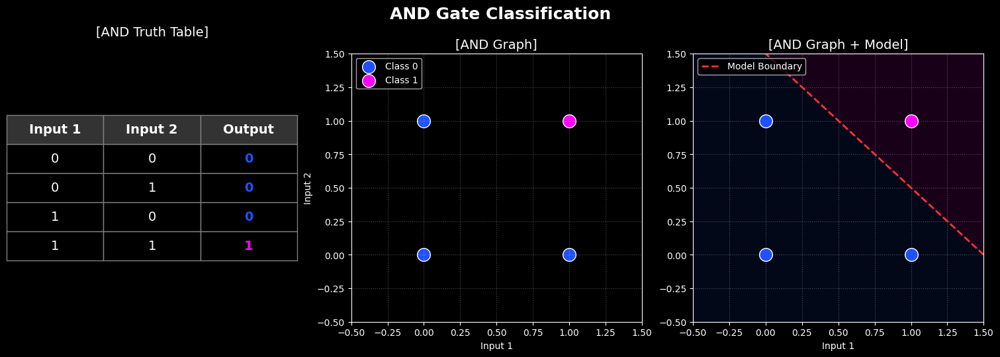

다음 그림의 공들을 직선으로 분류한 세 번쨰 사진을 보니 성공적으로 두 영역이 나뉘었다.
모델의 직선 위쪽으로는 검은 공을 위한 영역
아랫쪽으로는 하얀 공을 위한 영역이 되었다!
   
## 2. OR
다음으로는 OR를 살펴보자 OR는 두 입력 중 하나라도 1이면 1이 되는 연산이다.   

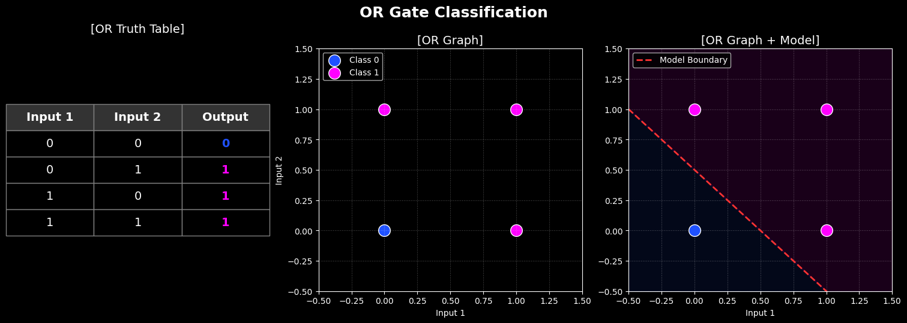

## 3. XOR 문제

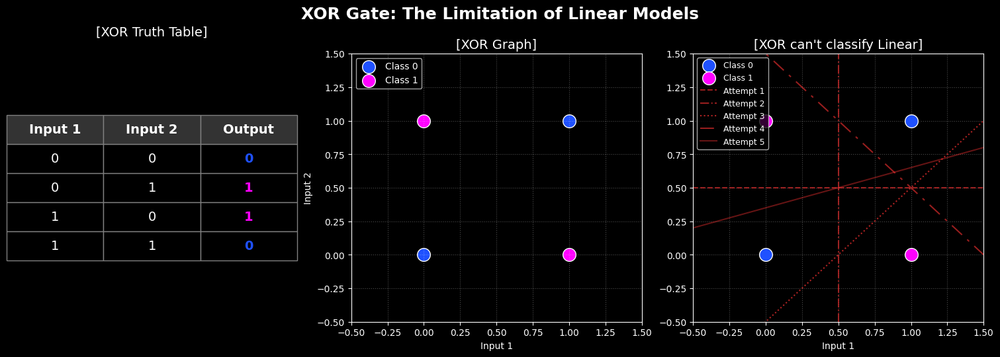
이 XOR, 배타적 논리합은 두 입력 값이 다를 때에만 1이 된다.

이를 그래프에 검은 공과 하얀 공으로 나타낼 수 있다.
이걸 한 번, 직선 모델로 분류해보자   
세번쨰 그림처럼 여러번 시도해보았지만, 어떤 직선으로 나누어도 두 영역에 공이 섞여 있다.

즉, **선형 모델로는 XOR 문제를 풀 수 없다**

세상의 다양한 논리들 중 이 XOR는 굉장히 중요하다.
하지만, 이조차 풀지 못하는 모델은, 필요할까?

이것이 15년의 인공지능의 빙하기를 불러왔다.

## 4. XOR 문제를 풀려면

XOR 문제를 해결하고 싶다면 역시 모델이 휘어져야 할 것 이다.

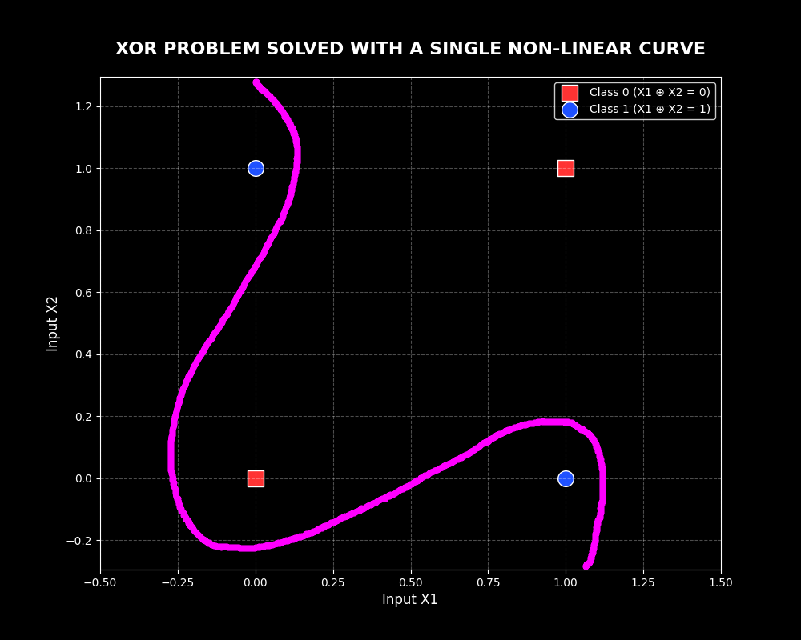

이렇게 모델이 휘어지면서, 이들을 성공적으로 분류하였다.

# 활성화 함수란?

이 XOR 문제를 푸는건 굉장히 중요한 인공지능의 과제로 남아있었다.
이를 해결하기 위해서는 들어온 입력이 훅 하고 휘어져서 나가야 한다.

이건 신호의 왜곡 현상에서 아이디어가 나왔다.

## 1. 신호의 관점에서

정현파(sin파)의 y값을 비선형적인 함수인 '시그모이드'라는 함수에 넣어보자.

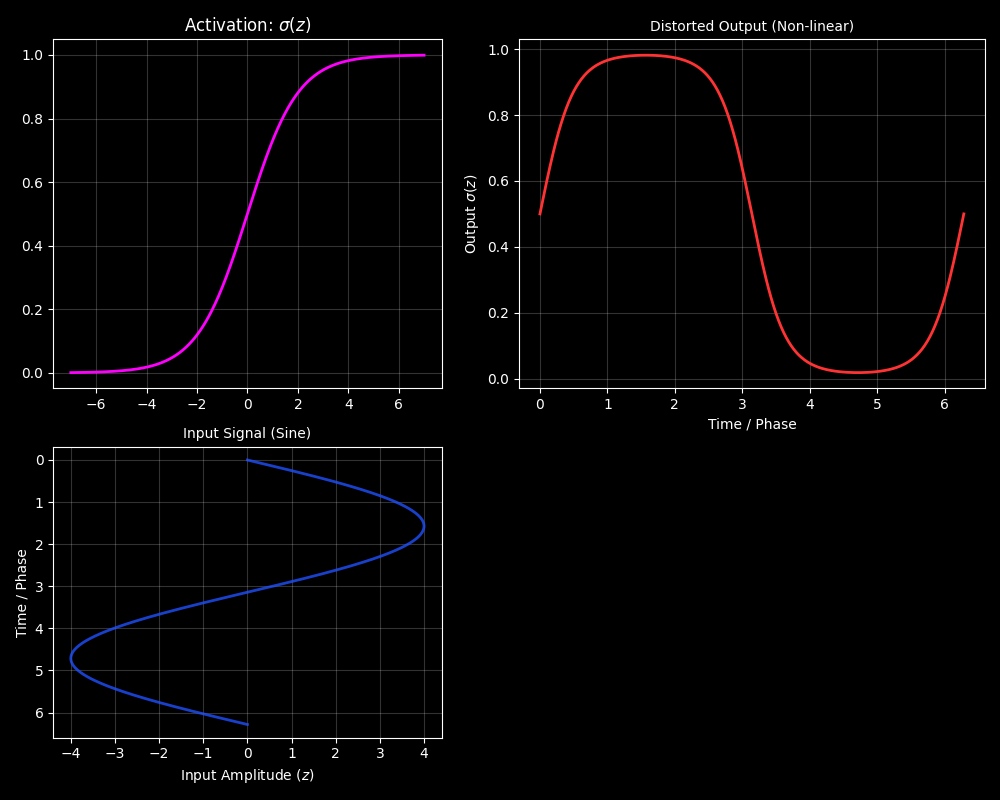

그러면, 이렇게 일반적인 정현파가 아닌 무언가 부드럽게 잘린 모양이 나온다.

인공신경망에서 각 노드는 자신의 값을 가지고 있다. 우리는 쉽게 신호로 보기 위해서, 한 번 진폭과 위상이 다른 여러 신호에 대해서 이를 알아보자

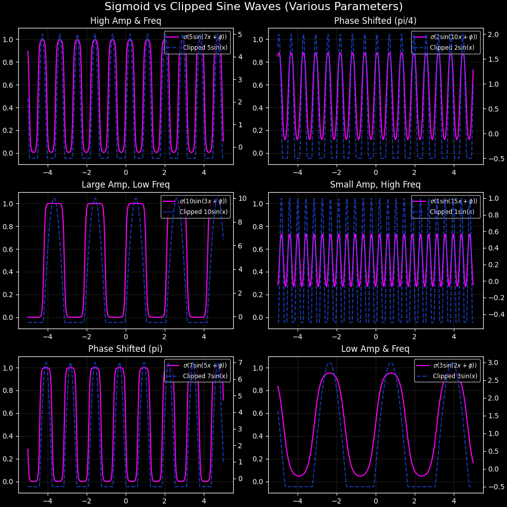

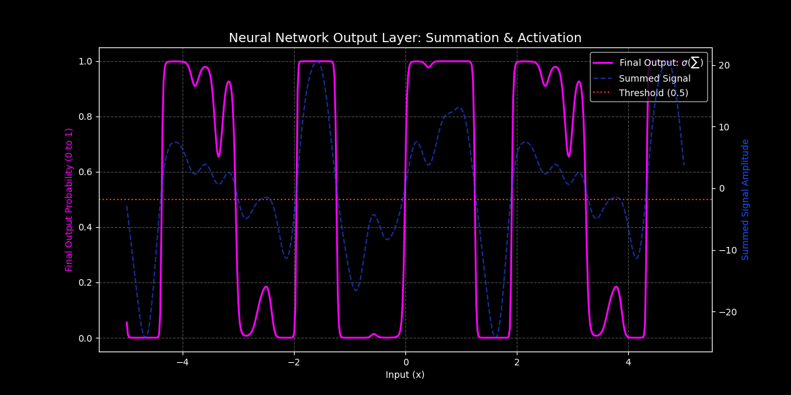

이렇게 우리는 여러 sin(x)를 넣었는데, 이 활성화 함수를 지나자 0과 1사이에서 굉장히 복잡한 어떤 값이 되었습니다.

## 2. 인공신경망의 관점에서

앞서 정현파가 활성화 함수를 만나면 어떻게 찌그러지는지 보았다. 이제 진짜 인공신경망에 넣어보자.

은닉층이 2개인 신경망을 생각해보자.
여기에 y=2x+3 이라는 아주 쭉 뻗은 직선 신호를 입력으로 넣을 것이다.

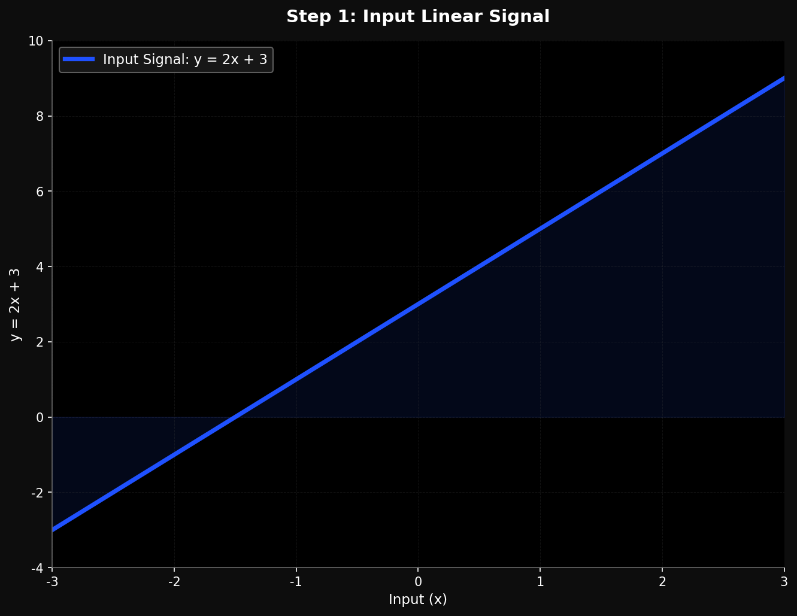

일단 입력층으로 직선 신호가 들어간다. 아직은 그냥 직선이다. 이 신호가 첫 번째 은닉층으로 간다.

여기서 각 노드의 가중치를 곱하고 편향을 더한다. 값은 변하지만 여전히 직선 형태에서 벗어나진 못한다.하지만 노드 끝에 있는 '활성화 함수'를 통과하는 순간, 드디어 직선이 훅 하고 구부러진다.
아까 정현파가 잘렸던 것과 똑같다

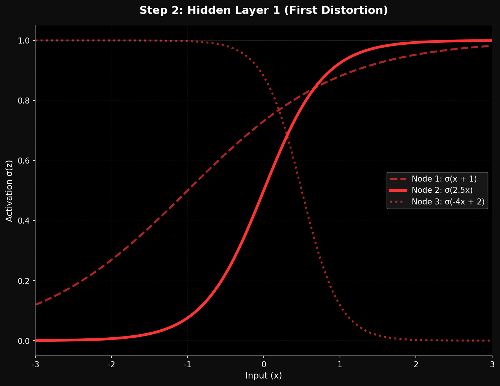

첫 번째 은닉층을 지나니, 하나의 밋밋했던 직선이 여러 개의 휘어진 선으로 바뀌었다.
이제 이 휘어진 선들이 두 번째 은닉층으로 들어간다.

마찬가지로 가중치를 곱하고 더한 다음, 활성화 함수를 한 번 더 통과한다.

이미 구부러진 선들을 모아서 또 찌그러뜨리는 것이다.

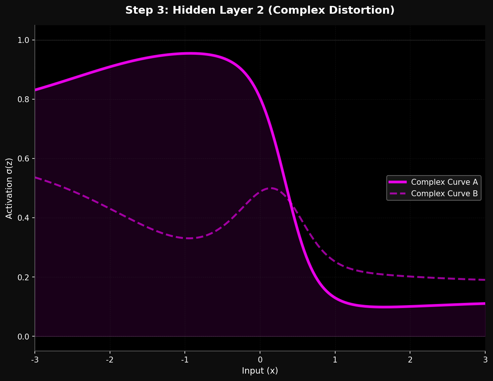

이제 신호는 더 이상 단순한 선이 아니다. 아주 복잡한 모양이 되었다. 마지막으로 출력층이다.

두 번째 은닉층에서 만든 이 복잡한 선들을 하나의 출력 노드로 다 합친다.

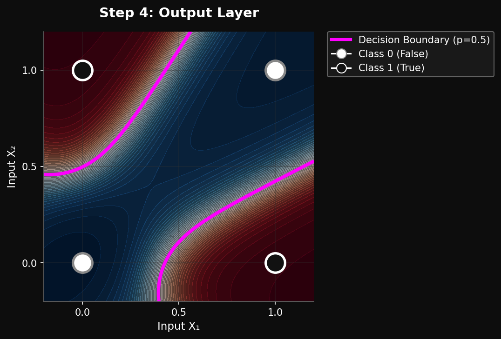

다 합치고 나면, 우리가 그토록 원했던 XOR를 풀 수 있는 굽어진 모델이 완성된다.

위 이미지는 numpy를 이용해서 실제 모델을 만들어서 학습시킨 결과이다.

결국 활성화 함수란, 빳빳한 직선 신호를 의도적으로 왜곡시키고 찌그러뜨리는 역할을 한다.

층이 깊어질수록 신호는 더 복잡하게 찌그러지고, 이것들을 다 합치면 선형 모델로는 절대 풀 수 없던 XOR 문제를 해결할 수 있게 되는 것이다.